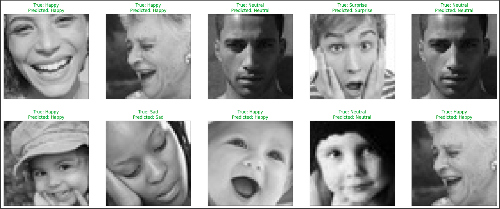

# EmoSound-Emotion-Based-Music-Recommender-Resnet50V2
EmoSound: Feel the Music. Our emotion-based music recommender understands your mood, crafting playlists that resonate with your feelings in the moment. Say goodbye to generic playlists and hello to a personalized soundtrack for every emotion.

